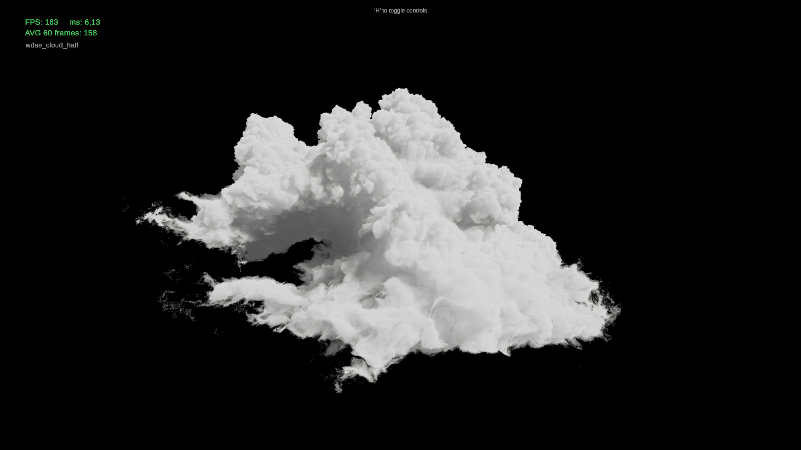

# Unity NanoVDB Volume Renderer

*Screenshot for my final render at 1920x1080 in 6 ms of the WDAS cloud dataset. Tested on RTX 3080 at stock clock speeds.*

I made this project as part of the [DD2470 Advanced Topics in Visualization and Computer Graphics](https://www.kth.se/student/kurser/kurs/DD2470?l=en) course at KTH during end of 2024. My aim for the project was to render the [Disney Moana cloud](https://disneyanimation.com/resources/clouds/) (half resolution), at acceptable real-time frame rates, while keeping visual degradation low.

## Implementation

* Unity HDRP v6000.0.23f1
* [Fullscreen custom pass](https://docs.unity3d.com/Packages/com.unity.render-pipelines.high-definition@17.0/manual/Custom-Pass-Creating.html)
* Using a wrapper for NanoVDB, see [README in plugins folder](https://github.com/andersblomqvist/unity-nanovdb-renderer/tree/main/Assets/Plugins)
* Your typical ray marching algorithm with only directional light

I've listed the source files of importance:

* [NanoVolumeCustomPass.cs](https://github.com/andersblomqvist/unity-nanovdb-renderer/blob/main/Assets/NanoVDB/NanoVolumeCustomPass.cs) - handle the rendering on CPU
* [NanoVolumeCustomPassShader.shader](https://github.com/andersblomqvist/unity-nanovdb-renderer/blob/main/Assets/NanoVDB/NanoVolumeCustomPass.shader) - unity shader that calls my ray marcher
* [NanoVolumePass.hlsl](https://github.com/andersblomqvist/unity-nanovdb-renderer/blob/main/Assets/NanoVDB/NanoVolumePass.hlsl) - the ray marcher that draws the volume
* [NanoVolumeLoader.cs](https://github.com/andersblomqvist/unity-nanovdb-renderer/blob/main/Assets/NanoVDB/NanoVolumeLoader.cs) - resposible for loading the NanoVDB into Unity
* [NanoVDBWrapper.cpp](https://github.com/andersblomqvist/unity-nanovdb-renderer/blob/main/Assets/Plugins/NanoVDBWrapper.cpp) - wrapper for the NanoVDB C++ library

And of couse, this would not be possible with out [PNanoVDB.h](https://github.com/AcademySoftwareFoundation/openvdb/blob/master/nanovdb/nanovdb/PNanoVDB.h), which I've imported as `PNanoVDB.hlsl` instead, just for clarity. This is where the magic happens.

## Built version in releases

A prebuilt version as an `.exe` is found under releases. It will hopefully show the WDAS cloud.

## Some caveats, if you wish to run in Unity Editor

This implementation is more of a proof of concept, rather than a complete project. This means, I have an absolute path to the `wdas_cloud_half.nvdb` file, which is excluded from this repo, making it a bit more cumbersome from someone else to run. You have to download a regular `.vdb` file, convert it to a `.nvdb` and place it directly under the `Assets/` folder. Then inside Unity Editor, make sure that the `NanoVolumeLoader.cs` on the `Volumetric Cloud Pass` game object has correct path.

I decided to read `.nvdb` directly just to skip importing all of OpenVDB.

## Resources

List of sources I have used in no particular order:

**Walt Disney Animation Studios**. “Walt Disney Animation Studios - Clouds.” Accessed January 6, 2025. https://disneyanimation.com/resources/clouds/.

**Museth, Ken**. “NanoVDB: A GPU-Friendly and Portable VDB Data Structure For Real-Time Rendering And Simulation.” In ACM SIGGRAPH 2021 Talks, 1–2. Virtual Event USA: ACM, 2021. https://doi.org/10.1145/3450623.3464653.

**Museth, Ken**. “Hierarchical Digital Differential Analyzer for Efficient Ray-Marching in OpenVDB.” In ACM SIGGRAPH 2014 Talks, 1–1. Vancouver Canada: ACM, 2014. https://doi.org/10.1145/2614106.2614136.

**Gaida, Sebastian**. “Real-Time Implementation of OpenVDB Rendering.” Master’s Thesis, Universität Koblenz - Landau, 2022.

**Schneider, Andrew**. “Nubis3: Methods (and Madness) to Model and Render Immersive Real-Time Voxel-Based Clouds.,” August 5, 2023. https://www.guerrilla-games.com/read/nubis-cubed.

**Wrenninge, Magnus**. Production Volume Rendering 2017. 0 ed. A K Peters/CRC Press, 2012. https://doi.org/10.1201/b12698.

**Högfeldt, Rurik**. “Convincing Cloud Rendering - An Implementation of Real-Time Dynamic Volumetric Clouds in Frostbite.” Master’s Thesis, Chalmers University of Technology, 2016.

**Hillaire, Sebastien**. “Physically-Based & Unified Volumetric Rendering in Frostbite - Frostbite.” Electronic Arts Inc., August 20, 2015. https://www.ea.com/frostbite/news/physically-based-unified-volumetric-rendering-in-frostbite.

